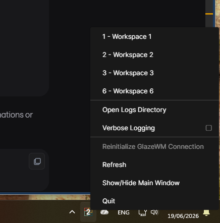
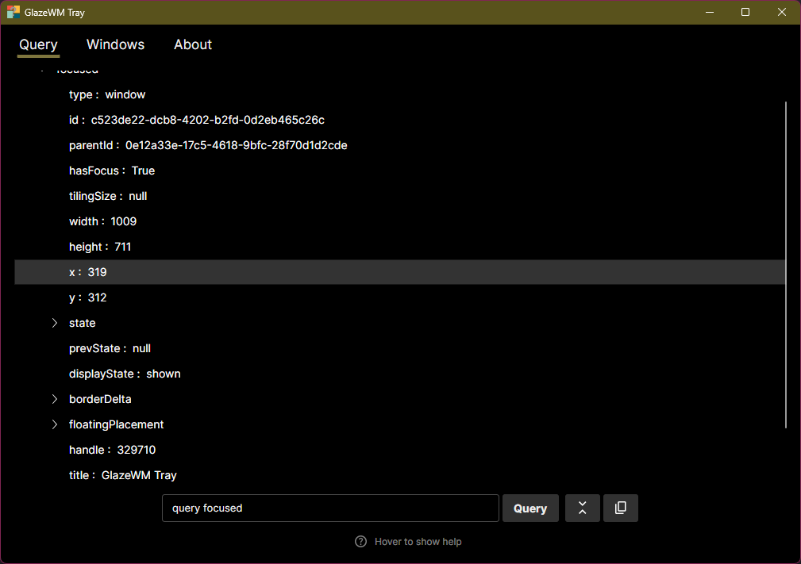
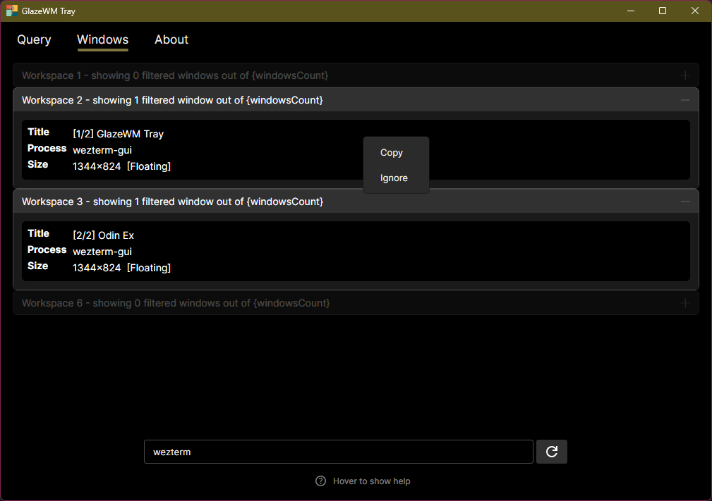

## GlazeWM Tray

GlazeWM-Tray is a system tray application to view GlazeWM status and perform some tasks. It's in _beta_ mode. It
currently supports:

- Showing the current active workspace (regardless of the monitor it is on). Only a single lowercase letter/digit is
  displayed – if the name is longer, the first letter/digit is used. The display name (if defined) is displayed in the
  menu / tooltip. If the name does not start with a letter or digit, it's displayed as a question mark.
- Indication if GlazeWM is paused (by grey letter/digit).
- Indication if using a custom binding mode (currently with question mark).
- Show all active workspaces (in menu) and use this menu to navigate to a workspace.
- Reconnect to GlazeWM (e.g., if GlazeWM quit unexpectedly).
- Refresh it's status – this could happen if you have a shortcut that performs several tasks (e.g. switch to workspace
  and pause) GlazeWM does not send event for every task so some state might be be lost.
- A Gui for querying _GlazeWM_ (e.g., `query workspaces`) and displaying the result in a TreeView.
- A Gui panel to display all windows by workspaces, allow filtering by name/process name, and right-click on a window
  for supported operation (currently copy data, and ignore).
- Left click on the tray icon to open the Gui (on _MacOS_ click on the icon and select _Show/hide Main Window_).

Since version `3.10` _GlazeWM_ runs on _MacOS_, so this app also runs on _MacOS_, but tested only lightly.

### ScreenShots

- *Tray icon with menu*:

  

- *Query Panel with rendering JSON in a TreeView*:

  

- *Windows list panel with filtering and context menu*:

  

### Installation

GlazeWM-Tray can be downloaded from the [releases page][releases] as a zip file – make sure you download the
architecture that matches your system.

On _Windows_, extract the zip to some directory, optionally create a link for GlazeWM-Tray.exe. Once running for the
first time, open the tray area and drag the icon to the taskbar. It should be visible on the taskbar from now on. It is
also available in my private [Scoop][] [bucket][] (the [bucket's readme][bucket] contains instructions and lists the
available manifests). It's also possible to add it to GlazeWM's `startup_commands` and `shutdown_commands` (similar to
the _Zebar_ example).

On _MacOS_, for now, you'll need to build it yourself. Once the project is restored and built, run
`dotnet run resources/scripts/package-macos.cs` and it should build a zip containing the app. If you need instructions
to build, open an issue.

### Planned Features

There will be more tools and utilitues to visualize and manipulate windows.

### Contributing

Except for the usual contributions (code, bug reports, docs, etc.), I'm looking for help with design (icons, GUI) and
usability. Please open an issue if you are willing to help.

[releases]: https://github.com/babysnakes/glazewm-tray/releases

[Scoop]: https://scoop.sh/

[bucket]: https://github.com/babysnakes/scoop-bucket